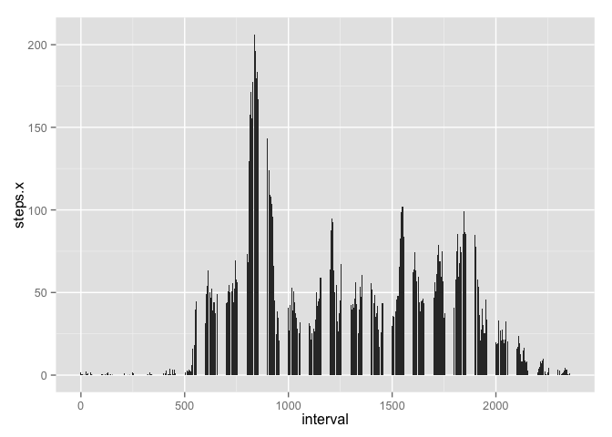
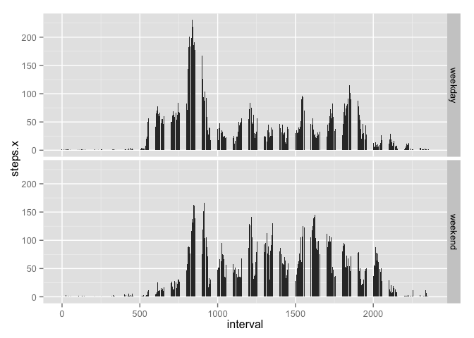

# Reproducible Research: Peer Assessment 1


## Loading and preprocessing the data

```r
data <- read.csv("./activity.csv")
```


## What is mean total number of steps taken per day?


```r
library(ggplot2)
library(scales)
```

```
## Warning: package 'scales' was built under R version 3.2.2
```

```r
library(date)
data$date <- as.Date(data$date)
aggdata <- aggregate( steps  ~  date , data = data , FUN = sum )
p <- ggplot(data = aggdata, aes(date, steps)) + stat_summary(fun.y = sum, geom = "bar") + scale_x_date(
  labels = date_format("%Y-%m-%d"),breaks = "1 week") 
```

```
## Warning: Incompatible methods ("+.gg", "Ops.date") for "+"
```

```
## Error in ggplot(data = aggdata, aes(date, steps)) + stat_summary(fun.y = sum, : non-numeric argument to binary operator
```

```r
#  opts(axis.text.x = element_text(angle=90))
p
```

```
## Error in eval(expr, envir, enclos): object 'p' not found
```

```r
mean_steps <- mean(aggdata$steps)
mean_steps
```

```
## [1] 10766.19
```

```r
median_steps <- median(aggdata$steps)
median_steps
```

```
## [1] 10765
```

## What is the average daily activity pattern?

```r
data$date <- as.Date(data$date)
plotdata <- aggregate(steps ~ interval, data, mean, na.rm = TRUE)

average_steps <- merge(data, plotdata, by="interval")
average_steps[!complete.cases(average_steps), 2] <- average_steps[!complete.cases(average_steps), 4]

plotdata <- aggregate(steps.x ~ interval, average_steps, mean)

library(ggplot2)
p <- ggplot(data=plotdata, aes(x=interval, y=steps.x))
p <- p + geom_bar(stat="identity")
p
```

 

Interval 835 had maximum average steps

## Imputing missing values
Total rows with missing data:

```r
sum(is.na(data$steps))
```

```
## [1] 2304
```

```r
#Replace NA with a constant value
data$steps[is.na(data$steps)] <- 30
aggdata <- aggregate( steps  ~  date , data = data , FUN = sum )
p <- ggplot(data = aggdata, aes(date, steps)) + stat_summary(fun.y = sum, geom = "bar") + scale_x_date(
  labels = date_format("%Y-%m-%d"),breaks = "1 week") + 
  theme(axis.text.x = element_text(angle=90))
```

```
## Warning: Incompatible methods ("+.gg", "Ops.date") for "+"
```

```
## Error in ggplot(data = aggdata, aes(date, steps)) + stat_summary(fun.y = sum, : non-numeric argument to binary operator
```

```r
p
```

 

```r
mean_steps <- mean(aggdata$steps)
mean_steps
```

```
## [1] 10487.34
```

```r
median_steps <- median(aggdata$steps)
median_steps
```

```
## [1] 10395
```


## Are there differences in activity patterns between weekdays and weekends?

```r
data <- read.csv("activity.csv")
data$date <- as.Date(data$date)

plotdata <- aggregate(steps ~ interval, data, mean, na.rm = TRUE)

average_steps <- merge(data, plotdata, by="interval")
average_steps[!complete.cases(average_steps), 2] <- average_steps[!complete.cases(average_steps), 4]

average_steps$day <- ifelse(grepl("^S", weekdays(average_steps$date)), "weekend", "weekday")
average_steps$day <- factor(average_steps$day)
plotdata <- aggregate(steps.x ~ interval + day, average_steps, mean)

library(ggplot2)
p <- ggplot(data=plotdata, aes(x=interval, y=steps.x))
p <- p + geom_bar(stat="identity")
p <- p + facet_grid(day ~ .)
p
```

 
